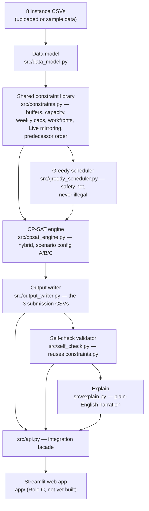

# Railway Track Access Optimisation — PS1

A scheduler that decides who gets the track, on which nights, for a
contested dual-line rail network — and proves its answer is feasible
against every hard safety rule. Built for the LTA Hackathon's Problem
Statement 1; full spec in [`docs/PS1_README.md`](docs/PS1_README.md).

```
instance CSVs (8 files) → src/api.py → schedule + score + plain-English explanation
```

## Status

| Deliverable | Owner | Status |
|---|---|---|
| 1. Public Test Results (3 scenarios × 3 CSVs, on the provided dataset) | Role B | ✅ done — `outputs/scenario_{A,B,C}/` |
| 2. Hosted live web app | Role C | ⬜ not started — see [Integrating the web app](#integrating-the-web-app-role-c) |
| 3. 3-minute video | Role D | ⬜ not started |
| 4. Git repo (GitHub/GitLab) | everyone | 🔶 in progress — see [Staging this repo](#staging-this-repo) |

**Solver (Role A) and data/validation (Role B) are functionally complete**: a
shared legality library, two interchangeable scheduling engines (a legality-
checked greedy safety net and a CP-SAT hybrid that's never worse), output
writers matching the exact submission schema, an independent self-check
validator, plain-English explainability, and an integration facade for the
web app — all covered by a 10-file regression suite. See
[`CLAUDE.md`](CLAUDE.md)'s "Current status" for the day-by-day build log and
[`docs/decisions.md`](docs/decisions.md) for every judgment call and why it
was made (**read this before changing solver logic** — several early
decisions were deliberately reversed after being measured wrong; the log
explains why so nobody re-makes the same mistake).

## Results on the provided sample

Penalty score (lower is better; the organizer's own sample submission is
`32.2` on Scenario A, its only scenario with a real answer key):

| Scenario | Rule | Our objective | Hard violations |
|---|---|---|---|
| A — Strict Supply, Flexible Schedule | capacity hard, ECLO forbidden | **0.0** (beats sample's 32.2) | 0 |
| B — Strict Schedule, Flexible Supply | dates hard, capacity/ECLO soft | **14** | 0 |
| C — Balanced trade-off | both soft, small capacity allowance | **7.0** (beats sample's 32.2) | 0 |

Both engines currently reach these exact numbers on this sample (all fully
feasible — zero hard-rule violations, 100% of the 54 activities' workload
placed); CP-SAT's actual guarantee is "never worse than greedy," not
"always identical" — see `tests/test_benchmark.py`, which is what actually
enforces that promise rather than just observing it here. Reproduce with
`python tests/test_benchmark.py`.

## Quickstart

```powershell
# Windows PowerShell, from the repo root
python -m venv .venv
.venv\Scripts\Activate.ps1
pip install -r requirements.txt

# Run the whole regression suite (~35-40s; CP-SAT/api tests dominate since they schedule all 3 scenarios)
foreach ($t in "smoke_test","test_path_resolver","test_constraints","test_output_writer",
               "test_self_check","test_greedy_scheduler","test_cpsat_engine","test_explain","test_api") {
    python "tests/$t.py"
}

# Schedule Scenario A — writes outputs/scenario_A/ (3 CSVs + report.json), the committed deliverable.
# Primary engine: picks whichever of {CP-SAT, greedy} scores better, falls back to greedy on a timeout.
python -m src.cpsat_engine A

# Plain greedy's own isolated result, for comparison only — writes outputs/scenario_A_greedy_only/ (gitignored)
python -m src.greedy_scheduler A

# Explain what happened, in plain English
python -m src.explain outputs/scenario_A
```

```bash
# macOS/Linux — same commands, different activation line
python -m venv .venv
source .venv/bin/activate
pip install -r requirements.txt
```

> **Windows note**: if a bare `python`/`pip` on your PATH resolves to a
> different interpreter without pandas installed, use
> `.venv\Scripts\python.exe` explicitly for every command above.

`tests/test_benchmark.py` (penalty-score comparison across the organizer's
sample, greedy, and CP-SAT, for all 3 scenarios) is a separate evaluation
script, not part of the fast suite — run it on demand.

## Running on your own input data (testers: start here)

Put your 8 instance CSVs in one folder, named exactly like the sample's
(`01_LINES.csv`, `02_STATIONS.csv`, `03_SECTORS.csv`, `04_LOCATION_SUPPLY.csv`,
`05_BUFFER_LOCATION.csv`, `06_PARAMETERS.csv`, `07_PROJECT_DETAILS.csv`,
`08_ACTIVITY_DETAILS.csv` — the sample is in `data/sample_instance/01_data/`).
Then run **one command** from the repo root:

```powershell
python -m src.api path\to\your_data all
```

That solves **all three scenarios** and writes, for each, exactly what
PS1_README §2.6/§2.7 asks for:

```
outputs/your_data/scenario_A/   SCHEDULE_ACCESS.csv  SCHEDULE_OCCUPANCY.csv  RESULTS.csv  report.json
outputs/your_data/scenario_B/   (same 4 files)
outputs/your_data/scenario_C/   (same 4 files)
```

(`report.json` is the §2.7 output report: `feasible`, `hard_violations`,
`soft_scores`, `objective_score`, ...). It also prints a plain-English
summary per scenario. Useful options:

| Option | Meaning |
|---|---|
| `A`, `B` or `C` instead of `all` | one scenario only |
| `--out some\folder` | write results under `some\folder\scenario_<X>\` instead |
| `--engine greedy` | use only the fast greedy safety net (default `cpsat` = best of CP-SAT and greedy) |
| `--time-limit 60` | give CP-SAT more seconds (default 20) |

Your results go to `outputs/<your folder name>/` — **never** over the
committed sample results in `outputs/scenario_{A,B,C}/`. Exit code: `0` if
every requested scenario is feasible, `1` if any isn't, `2` if the input is
invalid (missing file/column, dangling reference, predecessor cycle — the
message says exactly what). Prefer a UI? The web app calls the same code
(`src.api.solve`).

> `python -m src.cpsat_engine A` / `python -m src.greedy_scheduler A` (Quickstart
> above) only ever read the bundled sample — they regenerate our committed
> Public Test Results and can't take another folder. Use `src.api` for any other data.

## How it works



**One rule, checked once, everywhere.** Every legality rule (buffers, Live-
rail mirroring, capacity, legal-mix packing, weekly caps, workfronts,
predecessor order, workload conservation) lives exactly once, as a pure
function in `src/constraints.py`. The greedy scheduler, the CP-SAT engine,
and the self-check validator all call the *same* functions — they can never
silently disagree about what's legal.

**Two engines, one contract.** `src/greedy_scheduler.py` and
`src/cpsat_engine.py` both expose `schedule(instance, scenario) ->
ScheduleState`. The greedy scheduler is a fast, deterministic, no-
backtracking pass that never accepts an illegal placement — a safety net
that always finishes. The CP-SAT engine (Google OR-Tools) additionally
plans the temporal shape of the schedule (predecessor order, ECLO usage)
under a hard time limit, hands that plan to the same greedy placement logic
to actually site each access, and — because that heuristic helps some
scenarios and mildly hurts others — automatically keeps whichever of the
two results scores better. **CP-SAT can never score worse than greedy, by
construction.**

**Scenario A/B/C are one config, not three solvers.** `ScenarioConfig`
(in `src/constraints.py`) toggles which rules are hard vs. soft: capacity
is hard only in Scenario A, completion date is hard only in Scenario B,
ECLO is forbidden only in Scenario A. Both engines read the same config
object — there is no scenario-specific code path to keep in sync.

## Scenarios, briefly

| | A — Strict Supply | B — Strict Schedule | C — Balanced |
|---|---|---|---|
| Location capacity | **hard** (zero excess) | soft (unlimited) | soft (1 excess/location-week free) |
| Completion date | soft (score overrun) | **hard** (zero overrun) | soft (score overrun) |
| ECLO | **forbidden** | allowed | allowed, continuity-windowed |
| Objective | priority-weighted overrun | extra access-nights + ECLO | both, summed |

## Repo layout

```
src/
  data_model.py        # Instance dataclass, load_instance(), path resolver
  constraints.py        # shared hard-rule legality library — the single source of truth
  greedy_scheduler.py    # safety-net engine: schedule(instance, scenario) -> ScheduleState
  cpsat_engine.py        # CP-SAT hybrid engine — same signature, never worse than greedy
  output_writer.py       # ScheduleState -> the 3 submission CSVs
  self_check.py          # submission CSVs -> replay through constraints.py -> report
  explain.py              # plain-English capacity-pressure / trade-off narration
  api.py                  # integration facade — what the web app imports (see below)
tests/                    # 9 fast regression tests (~35-40s) + 1 slower benchmark, mirroring src/
data/sample_instance/     # the organizer's 8 instance CSVs + their own sample submission
docs/
  PS1_README.md           # the full problem statement
  Project_Framework.md    # the team's original plan (see decisions.md for what superseded it)
  decisions.md            # READ FIRST — every assumption/judgment call and why
outputs/
  scenario_{A,B,C}/             # the committed deliverable — 3 CSVs + report.json, written by cpsat_engine
  scenario_{A,B,C}_greedy_only/ # plain greedy's own result, dev-time comparison only (gitignored)
app/                            # Role C's Streamlit app goes here
```

## Integrating the web app (Role C)

Import `src/api.py` — it's the one module the app needs; it composes the
solver pipeline so the app never has to know engine internals, temp
directories, or call order.

```python
from src.api import load_instance_from_uploads, load_sample_instance, validate_instance, solve, SolveError

# From Streamlit's file_uploader:
# instance = load_instance_from_uploads({f.name: f for f in uploaded_files})
instance = load_sample_instance()

problems = validate_instance(instance)
if not problems.ok:
    st.error("\n".join(problems.errors))
    st.stop()

try:
    result = solve(instance, scenario="A", engine="cpsat")
except SolveError as e:
    st.error(str(e))
    st.stop()

st.metric("Feasible", result.feasible)
st.metric("Objective score", result.objective_score)
st.json(result.metrics)                          # flat dict of KPI numbers, ready for st.metric/st.dataframe
st.write(result.explanation["summary"])           # list[str] — plain-English narration
st.plotly_chart(px.timeline(result.activity_timeline, x_start="start_date", x_end="end_date", y="activity_id", color="contract_number"))
st.download_button("Download submission (zip)", result.to_zip_bytes(), "submission.zip")
```

- `load_instance_from_uploads` accepts bytes, paths, or file-like objects
  (Streamlit's `UploadedFile` works directly), matches filenames loosely
  (case/prefix-tolerant), and raises `SolveError` with a message you can
  show the user directly — never a bare exception — if anything's missing
  or malformed.
- `validate_instance` catches structural problems (missing files, dangling
  references, unresolvable paths, predecessor cycles) *before* the solver
  runs, so a bad hidden instance fails fast with a clear message instead of
  a stack trace mid-solve.
- `solve()` never raises for a merely bad score — only for an invalid
  instance or the rare case where no legal schedule exists at all. If
  CP-SAT itself errors unexpectedly it silently falls back to greedy and
  records why in `result.warnings`.
- `result.files()` / `result.to_zip_bytes()` / `result.write(path)` give you
  the 3 submission CSVs (plus a `report.json`) in whatever shape you need
  for a download button or to save to disk.
- CLI without any UI, on any data folder: `python -m src.api <folder> all`
  (see [Running on your own input data](#running-on-your-own-input-data-testers-start-here)).

Everything is in-memory — no working-directory assumptions — so it's safe
to call from a Streamlit script on every rerun.

## Known, documented simplifications

Per the brief's own guidance ("ship a simplified version and say so
explicitly — an honest trade-off beats silently ignoring a rule"):

- **Buffer/exclusion zones (§2.4 rule 4) are not hard-enforced.** The
  literal spatial-extension reading was measured to make every scheduler in
  this project perform ~26x worse than achievable, and directly contradicts
  the organizer's own sample submission on 34 (activity-pair, week)
  instances. It was removed after that evidence, but the sample data
  neither proves nor disproves what a hidden validator actually checks — see
  `docs/decisions.md`'s "Buffer/exclusion-zone rule" entries for the full,
  measured evidence chain. As a hedge, both engines *prefer* (for free,
  where possible) not to place two buffer-carrying activities with
  overlapping footprints in the same week unless they're co-share-connected
  — see `constraints.buffer_proximity_pairs` and `detail.buffer_proximity_
  pairs` in every self-check report. Live-rail opposite-bound mirroring and
  interchange crossover (§2.2) are a separate rule and remain fully hard.
- **One access-night per activity per week (§2.4 rule 10) is read as
  scoped to that rule's own ECLO-continuity context, not enforced as a
  universal cap** (`ScenarioConfig.one_access_per_activity_week=False` by
  default). Rule 10's premise sentence sits entirely inside a rule titled
  "ECLO Continuity Window (Scenario C only)"; every OTHER rule governing
  weekly access-night usage (rules 6/7/8, §2.1 point 4, §2.6) is phrased at
  the contract level, never per-activity — see `docs/decisions.md` for the
  full argument (this was reconsidered twice in one day after a direct
  challenge to an earlier, too-hasty literal reading). A non-default,
  opt-in strict mode exists (`strict_one_access_per_week=True` in
  `src/api.py`'s `solve()`, or `--strict-one-access-per-week` on the CLI)
  for the literal universal reading — it scores worse but is the safer
  choice if a hidden validator does enforce it; using it attaches a
  warning to the result, never silent.

## Docs map

- [`docs/PS1_README.md`](docs/PS1_README.md) — the problem statement.
- [`docs/Project_Framework.md`](docs/Project_Framework.md) — the team's
  original plan; superseded in places by `docs/decisions.md` (read that
  first if the two disagree).
- [`docs/decisions.md`](docs/decisions.md) — the living decisions log.
  Every non-obvious judgment call, every reversal, and why — this is what
  carries context across sessions and should be read before touching
  solver logic.
- [`CLAUDE.md`](CLAUDE.md) — day-by-day build status and working
  conventions for AI-assisted development on this repo.

## Staging this repo

No git installation was found on the machine this was developed on, so the
steps below are for you to run. From the repo root:

```powershell
git init
git add .
git commit -m "Initial commit: solver (Role A) + data/validation (Role B) complete"

# GitHub
git remote add origin https://github.com/<you>/<repo>.git
git branch -M main
git push -u origin main

# GitLab (the brief's own required target — see PS1_README.md §4)
git remote add origin https://gitlab.com/<you>/<repo>.git
git branch -M main
git push -u origin main
```

Before the first commit, regenerate the Public Test Results if `src/` has
changed since they were last written (they're committed on purpose — see
`.gitignore`'s comment):

```powershell
foreach ($s in "A","B","C") {
    python -m src.cpsat_engine $s   # writes the committed outputs/scenario_<X>/
}
```

**Note:** the brief's §4 deliverable list asks for a **GitLab** URL
specifically; GitHub is offered above as an alternative in case that's what
you actually intend to submit — worth double-checking against the brief
before you pick one.
