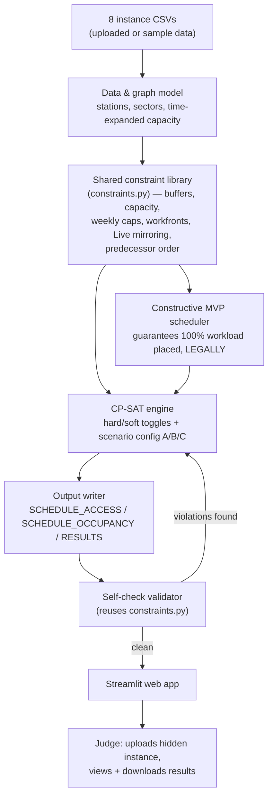

# Railway Track Access Optimisation — Project Framework & Implementation Plan

**Team size:** 4 people · **Time budget:** 8–12 hours · **Goal:** ship all 4 required deliverables with a feasible, explainable, live-demoable scheduler.

This document is the single source of truth for *how* we build this, not *what* the problem is (that's `PS1_README.md`). Read it once, top to bottom, before writing any code — it tells you what to build, in what order, who owns what, and why we made each call.

> **Revision note:** this version corrects an earlier mistake in Phase 2's plan (the greedy scheduler was originally allowed to violate hard rules — it must not; see Decision #1 and §8.3). It also folds in things we only learned once we actually opened the real instance data — see §5.1. The living, continuously-updated version of these corrections lives in the repo at `docs/decisions.md`; treat that file as authoritative if it ever disagrees with this one, and update this document from it periodically rather than letting them drift apart.

---

## 0. How to use this document

- **Everyone** reads §1–§6 once at kickoff (30 min, together, out loud). This is the shared mental model — skipping this is the #1 cause of hackathon teams building four things that don't fit together.
- Each person then lives mainly in **their own row of §7** (the hour-by-hour plan) and their **role section in §8**.
- §9–§15 are reference material — dip into them when you hit the relevant step. You don't need to read the whole thing before starting.
- If something in this plan stops making sense once you're in the data, **change the plan, don't fight it** — but write down what changed and why (Role D tracks this; it becomes explainability content for free). The repo's `docs/decisions.md` is where that log actually lives day-to-day; this document gets updated from it at checkpoints, not the other way around.

---

## 1. What we're actually delivering

Four things, non-negotiable, per the brief's §4:

| # | Deliverable | What it actually is | Who "owns" it |
|---|---|---|---|
| 1 | **Public Test Results** | 3 sets of `SCHEDULE_ACCESS.csv` / `SCHEDULE_OCCUPANCY.csv` / `RESULTS.csv` (one per scenario A/B/C), computed on the *given* dataset | Role B |
| 2 | **Hosted Live Web App** | A URL where a judge uploads their own (hidden) 8-file instance and gets a schedule back, visualized | Role C |
| 3 | **3-min YouTube video** | Walkthrough for a "2AM works controller" persona, showing the app + explainability | Role D |
| 4 | **GitLab repo** | Clean source, README, setup instructions | Role D (with everyone committing) |

Everything else in this document exists to get these four things done, in this order of priority: **feasibility → the app → the docs/video**. A submission with a slightly worse score but all four deliverables present beats a perfect solver with no video. **"Feasibility" means what the brief's own §1 non-negotiables mean by it: zero hard-rule violations, not just "code that runs."** A fast solver that ships an infeasible schedule has not achieved feasibility — see Decision #1 below.

---

## 2. Team roles

We split by **deliverable ownership**, not by seniority — this matters because it means every person, including anyone without a strong programming background, owns something essential and has a clear "done" state.

| Role | Nickname | Main job | Coding intensity |
|---|---|---|---|
| **A — Solver Lead** | "makes it schedule" | Builds the scheduling engine (legality-checking greedy → CP-SAT) | High |
| **B — Data & Validation Lead** | "makes it correct" | CSV parsing, output writers, the self-check script, running the validator, tracking scores | Medium |
| **C — Product Lead** | "makes it usable" | Web app: upload, run, visualize, download, deploy | Medium |
| **D — Docs & Story Lead** | "makes it explainable" | README, architecture notes, GitLab hygiene, video script + edit, explainability copy | Low |

**Why this split:** in a 4-person team where not everyone is a programmer, the failure mode to avoid is "2 people code everything while 2 people wait." Here, Role D can start working productively in minute one (repo setup, glossary, video storyboard) with zero programming, Role B is mostly spreadsheet-shaped work (schemas, counting rows, checking outputs), and only Roles A and C need to write substantial code — and even then, §8 gives them a skeleton to start from rather than a blank file.

If your team's skills don't map neatly onto this (e.g. only one strong programmer), see the **fallback note in §12** — the plan still works, it just reshuffles hours.

---

## 3. Design philosophy — the 6 decisions that shape everything else

These are the calls we made in advance so the team doesn't re-debate them mid-hackathon. Each is explained so you can defend it to judges if asked.

1. **Build a "safety net" first, optimize second — but the net itself must be legal.** The brief's §1 non-negotiable #1 is that 100% of activities must be scheduled — this is checked *before* any quality scoring. So the very first working version of the scheduler will be a dumb, fast, constructive pass that guarantees every activity gets *a* slot, even if the result is a mediocre score. **Mediocre means bad overrun/extra-access-night numbers — it never means an infeasible schedule.** The brief's §1 non-negotiable #2 is just as absolute as #1: hard physical safety rules "must never be breached," and Scenario A hard-fails the entire submission on any capacity excess. So every hard physical rule (buffers, Live-rail mirroring, weekly allocation caps, workfronts, the legal-mix packing pattern, and predecessor completion — see §5.1) is enforced from this very first version, checked against one shared rule-checking module (§8.2a). Only each scenario's own designated flex point — completion date in Scenario A/C, extra access-nights/ECLO in Scenario B/C — is allowed to absorb congestion. We only improve the *score* on top of that; we never trade away feasibility for speed. (This mirrors a validated real-world approach — see the ProRail rail-maintenance paper we reviewed earlier: their greedy algorithm also only ever accepts a legal placement, and only accepts a violation as an absolute last resort when nothing in the entire plan window works — see their §4.2. Their 15-minute deterministic greedy pass nearly matched their 24-hour evolutionary algorithm's *average* result.)

2. **One engine, three configs — not three solvers.** Scenarios A/B/C are the same constraints and the same objective function with a few terms switched between "hard" and "soft" (see brief §2.5). We will write **one** `scenario_config` object (a dictionary of toggles) that both the constructive scheduler and the CP-SAT engine read from — the constructive scheduler uses it to know which flex lever it's allowed to pull under congestion (see Decision #1), and CP-SAT uses it to toggle which terms are hard vs. soft in the model. Writing three separate solvers, or hardcoding scenario logic into either engine, would triple our risk and our debugging time for zero benefit.

3. **CP-SAT (via Google OR-Tools) as the core solver, with the constructive scheduler always kept alive as a fallback.** CP-SAT is free, has no license friction, and its native building blocks (interval variables, `NoOverlap`, `Cumulative`) map almost one-to-one onto this problem's buffers and capacities. But CP-SAT can, in principle, run out of time on a hard instance — so we always keep Decision #1's scheduler in the codebase as a hard timeout fallback: *if CP-SAT hasn't found a feasible-and-complete solution in N seconds, fall back to that result.* Because that result is already legality-checked (Decision #1), this fallback is a safe one — a judge uploading a hidden instance should never see our app hang, crash, or emit an infeasible schedule.

4. **Streamlit for the web app, not a custom frontend.** We need a *hosted, usable* web app in a few hours, built partly by non-frontend-specialists. Streamlit turns "upload a file, run some Python, show a table/chart, offer a download" into single-file Python scripts with almost no HTML/CSS/JS required. This directly serves the "Ease of Use" judging dimension without spending hours on frontend plumbing.

5. **Explainability is generated from solver internals, not written by hand.** Rather than manually writing prose explanations, we log *which constraint was binding* and *which activity/week/location* whenever the solver has to compress or overrun something, and turn that log into plain sentences. This is cheap to build and scores directly against "trade-offs... explained, not just produced" in the rubric.

6. **A shared constraint-checking library is built once and reused everywhere.** Buffer/exclusion legality, capacity legality (co-share-credit-aware, scenario-parameterized), weekly-allocation + workfront legality, Live-mirroring + interchange propagation, and predecessor completion are each implemented **exactly once**, in `src/constraints.py` (see §8.2a), and reused by the constructive scheduler, the self-check validator, and (informing) the CP-SAT model. This exists specifically to make Decision #1 possible without three copies of the same rules quietly drifting out of sync with each other.

---

## 4. Recommended tech stack

| Layer | Choice | Why | Alternative (if blocked) |
|---|---|---|---|
| Language | **Python 3.11+** (team is standardizing on 3.13) | Everyone can read it; has every library we need; fastest to write under time pressure | — |
| Data handling | **pandas** | CSV in, CSV out, is 90% of this problem's plumbing | — |
| Solver | **Google OR-Tools CP-SAT** | Free, no license server, native support for interval/no-overlap/cumulative constraints (buffers, capacities) | A hand-written constructive scheduler + local-search only (decision #3's fallback) |
| Fallback/MVP scheduler | **Plain Python constructive heuristic, legality-checked against `src/constraints.py`** | Guarantees deliverable #1 exists within the first ~2–3 hours, without ever emitting an infeasible schedule | — |
| Web app | **Streamlit** | Single-file Python apps, built-in file upload/download widgets, near-zero frontend code | Gradio (very similar trade-offs) |
| Visualization | **Plotly** (`plotly.express.timeline` for a Gantt-style view) | Interactive, works inside Streamlit with one line of code | Matplotlib static charts |
| Hosting | **Hugging Face Spaces** (add as a second git remote to the same GitLab repo) | Free, deploys straight from a `git push`, keeps GitLab as the single source of truth | Render.com (also supports deploying directly from a GitLab repo URL); revisit once GCP access arrives in case it changes this |
| Version control | **GitLab** (required by the brief) | — | — |
| Task tracking | **GitLab Issues** (or a shared doc/Trello if simpler) | Keeps a paper trail of who's doing what — doubles as evidence of process for judges | — |

**Why not MILP or a pure metaheuristic (genetic algorithm, simulated annealing)?** We covered this in depth earlier in this conversation — short version: MILP solvers hit exactly the wall the ProRail paper documents (hours for tiny instances), which is too risky for a live demo; a pure metaheuristic needs many hours of tuning to beat a well-built CP-SAT model on a problem this constrained. CP-SAT sits in the sweet spot for an 8–12 hour budget.

---

## 5. Glossary (read once, out loud, as a team)

| Term | Plain-language meaning |
|---|---|
| **Feasible** | A schedule that breaks none of the "must never happen" rules (safety buffers, capacity, weekly caps, etc.) |
| **Hard constraint** | A rule that can never be broken (e.g. two possessions can't overlap in the same slot without co-sharing) — note that in this problem, *which* rules are hard is itself scenario-dependent for two of them (capacity, completion date); see §5.1 |
| **Soft constraint / objective** | A rule we'd *prefer* to satisfy, scored as a penalty when broken (e.g. finishing late) |
| **CP-SAT** | A constraint-solving engine: you describe the rules and what you want to minimize, and it searches for a solution. Think "a very fast, very literal-minded assistant that tries millions of combinations for you." |
| **Constructive / greedy heuristic** | A simple algorithm that makes the best-looking *legal* choice at each step and never looks back. Fast, not always optimal, but never gets "stuck" — and, in our implementation, never illegal either |
| **Scenario A/B/C** | Three different policy settings for the same problem — rigid supply/flexible schedule, flexible supply/rigid schedule, and a balanced middle ground |
| **Buffer / exclusion zone** | A safety gap before/after a worksite where no other work can happen |
| **Co-sharing** | Multiple compatible jobs occupying the same slot at the same time, which increases effective capacity |
| **ECLO** | "Early Closure, Late Opening" — buying extra working hours per night at the cost of disrupting passenger service more |
| **Objective function** | The single number the solver is trying to make as small as possible (total penalty score) |
| **`constraints.py`** | Our one shared module of pure legality-check functions, reused by every scheduler and the validator — see §8.2a |

---

## 5.1 Known data quirks & assumptions (read once, before you touch the data)

Things we only learned once we actually opened the real instance CSVs — none of these are visible from `PS1_README.md` alone. The living, detailed version of this list is `docs/decisions.md` in the repo; this is the summary every role should know.

- **`start_location_id`/`end_location_id` in `08_ACTIVITY_DETAILS.csv` are already full tunnel-sector location_ids** (e.g. `SEC:BET:S15_S16:EB`), not bare station ids. Simplifies the path resolver — no separate line/bound lookup needed.
- **`predecessor_activity_id` exists in the activities file (6/54 rows) and is not documented anywhere in the brief's rules section.** Working assumption, pending organizer confirmation: a successor may not start until its predecessor has **fully completed** all its `total_accesses` nights. If the organizer says otherwise, this changes in exactly one place (the precedence check in `src/constraints.py`).
- **Real `LOCATION_SUPPLY` capacities are much tighter at the interchange than the brief's illustrative example suggests.** `H01`/`H02` platforms and the `H01_H02` tunnel sector cap at capacity 1 on each line (not the brief's example figure of 4) — the real bottleneck in this instance, and the best adversarial case to test the solver against.
- **Capacity is enforced per `co_share_group` slot, not raw activity count.** Confirmed by checking the sample submission directly: grouping by `co_share_group` resolves 69 apparent capacity "violations" (counting raw activities) down to zero (counting distinct slots). This matters for how `constraints.py` and the CP-SAT `Cumulative` constraint are built.
- **The brief's `python3 -m trackaccess expand` CLI (for auto-generating `co_share_group`) was not provided to us.** We are writing that grouping logic ourselves. Per the brief §2.6, the label itself is arbitrary — it only needs to be unique per distinct possession at a `(location_id, week)`.
- **A real inconsistency exists between the brief's §1 and §2.5** on whether location capacity must *always* be hard (§1 says "must never be breached," unconditionally) or is scenario-dependent (§2.5 says Scenario B allows unlimited soft capacity excess, Scenario C allows a small hard-free allowance). We're treating §2.4/§2.5/§2.7 — the actual scoring mechanics the reference validator implements — as authoritative. **Worth asking the organizer directly if there's a Q&A channel.** Until then: capacity is hard only in Scenario A; completion date is hard only in Scenario B; ECLO is hard-forbidden only in Scenario A. Everything else (buffers, mirroring, weekly caps, workfronts, legal-mix, predecessor order) is hard in all three, no exceptions.

---

## 6. System architecture (the shape of the codebase)



This diagram is intentionally the same shape we discussed earlier, with one addition: **`constraints.py` sits underneath both schedulers**, not just CP-SAT — that's the fix to our earlier plan, where the constructive scheduler skipped legality checks entirely. This diagram (or a screenshot of it) is good material to reuse in both the README and the video.

---

## 7. Hour-by-hour plan

Timed for a **10-hour** midpoint. If you have 8 hours, drop the rows marked **[10–12h only]**. If you have 12, use the extra time to push further into §7's Phase 6 (explainability) or one bonus feature — don't add scope to earlier phases.

| Time | Phase | Role A | Role B | Role C | Role D |
|---|---|---|---|---|---|
| 0:00–0:45 | **Kickoff** | Read brief + this doc together. Confirm shared understanding. Set up dev environments. | | | Set up GitLab repo skeleton, issue board |
| 0:45–2:00 | **Foundations (parallel)** | Build network/graph model + `src/constraints.py` (shared hard-rule legality checks) + start constructive scheduler skeleton | Build CSV loader + output-writer stubs matching exact schemas | Scaffold Streamlit app shell with dummy data (upload → placeholder table) | Draft README skeleton, glossary, deliverables checklist |
| 2:00–4:30 | **Constructive MVP → first real submission** | Finish `constraints.py`; finish the constructive scheduler so every activity gets a **legal** slot (extending into overrun/extra-nights per scenario config when congested, never breaking a hard rule) | Wire loader+writer to Role A's scheduler; produce first real 3-file output set | Wire real pipeline into the app (upload → run constructive scheduler → show/download) | Build the self-check script (with Role B): reuses `constraints.py` rather than reimplementing checks |
| 4:30–7:00 | **CP-SAT core engine** | Build CP-SAT model: buffers, capacity + co-share packing, weekly caps, workfronts, Live mirroring. Wire scenario config (A/B/C toggle) — same config object the constructive scheduler already uses | Run self-check + official validator iteratively; log every violation found | Add schedule visualization (Gantt/timeline), scenario selector, per-scenario score display | Keep a running decision log (`docs/decisions.md`); start video storyboard/script |
| 7:00–8:00 | **[10–12h only] Explainability + one bonus feature** | Add solver logging (which constraint bound, where) | Turn logs into plain-English explanation strings | Surface explanations in the UI | Draft explainability copy for video narration |
| 8:00–9:30 | **Deploy + public test results** | Support debugging | Generate & save the official 3 scenario × 3 file "Public Test Results" set from the given dataset | Deploy to Hugging Face Spaces / Render; test with a *different* sample file, not just the given one | Finalize README setup instructions |
| 9:30–11:00 | **[10–12h only] Video + polish** | Fix any last solver issues | QA pass on all output files | Polish UI, fix visual bugs | Record + edit the 3-minute video |
| 11:00–12:00 | **[12h only] Buffer** | Contingency time for whatever's running late | | | Final GitLab cleanup, submit |

If you're running the compressed **8-hour** version: end Phase 3 (CP-SAT core) by hour 5, skip explainability/bonus entirely, and compress deploy + video + polish into the remaining 3 hours — the video can be shorter and simpler; it still needs to exist.

---

## 8. Phase details

### 8.1 Phase 0 — Shared understanding (all 4, together)
**Goal:** everyone can explain, in one sentence, what an "activity," a "contract," a "possession," and a "scenario" are, and can point at the network diagram and say which sectors a given activity would book.
**Why this matters:** the single biggest hackathon time-sink is discovering at hour 6 that two people modeled the same concept differently.

### 8.2 Phase 1 — Data model & parsers (Role B, supported by Role A)
- Load all 8 instance CSVs into pandas DataFrames.
- Build the **station-pair path resolver**: given a `start_location_id` and `end_location_id` (already full sector ids — see §5.1), return the ordered list of tunnel + platform sectors an activity books ("book-in" to "book-out"). Compute this **once** for all station pairs at startup — it doesn't change per activity, only which pairs are used does.
- Write the **output writer** stubs first, against the exact schemas in §10, even before the solver exists — this lets Role C wire the app end-to-end early with fake data.

### 8.2a Phase 1.5 — Shared constraint-checking library (Role A + B, before Phase 2)
This is new relative to our original plan, and it's what makes Decision #1 possible. Before writing the constructive scheduler, build `src/constraints.py`: pure functions, each checking exactly one rule, each taking the current partial schedule plus a candidate placement and returning legal/illegal (and why, for explainability later):

1. **Buffer/exclusion legality** — given a candidate activity+week+location, does its buffer (sized per nature-of-works: `Live` 2 sectors both sides + opposite-bound mirror, `Non-live (Consist)` 1 sector both sides, `Non-live (Others)` none) clear every other non-co-shared possession's span+buffer?
2. **Capacity legality** — counting distinct `co_share_group` slots (not raw activities — see §5.1) at a `(location, week)` against `LOCATION_SUPPLY`, parameterized by the active scenario's config (hard in A, soft-above-1 in C, unlimited-soft in B — see §9).
3. **Weekly allocation + workfront legality** — per `(contract, week)`, distinct `access_night` values ≤ `number_of_maximum_access_per_week`; per `(contract, week, access_night)`, distinct activities ≤ `number_of_workfronts`. Always hard, every scenario.
4. **Live-mirroring + interchange crossover** — a `Live` activity's closure mirrors onto the opposite bound, and — only at the interchange — also closes the other line's `H01_H02` tunnel sector and platforms. Always hard, every scenario.
5. **Predecessor completion** — per §5.1's working assumption, a successor's earliest legal night is after its predecessor's last night. Always hard, every scenario.

Both the constructive scheduler (§8.3) and the self-check validator (§11.1) import and call these same functions — never reimplement a rule check in more than one place.

### 8.3 Phase 2 — Constructive MVP scheduler (Role A, wired by Role B)
A simple, deterministic pass — **"greedy" describes the algorithm's speed and lack of backtracking, not a license to skip rules:**
1. Sort activities: highest `contract_priority` first, then `activity_priority`, then earliest `planned_start_date`.
2. For each activity, walk forward week by week from its earliest legal week (its `planned_start_date`'s week, or later if it has a predecessor — see §5.1), and place it in the first week/location combination that **passes every check in `src/constraints.py`.**
3. **Never skip an activity, and never accept an illegal placement.** If no legal slot exists within the current horizon, extend the search into later weeks — under Scenario A/C this is exactly the overrun the objective function is scoring anyway; under Scenario B (where dates are rigid), reach for the scenario's own designated lever instead: additional access-nights beyond nominal capacity and/or ECLO, per the scenario config from §9. The schedule this produces may score badly (lots of overrun, or lots of extra nights) — that's fine, it's the safety net, not the final answer. It must never be *infeasible*.

```python
# Illustrative skeleton — not complete, just the shape
def constructive_schedule(activities_df, supply_df, scenario_config):
    ordered = activities_df.sort_values(
        by=["contract_priority", "activity_priority", "planned_start_date"]
    )
    schedule = []
    for _, activity in ordered.iterrows():
        week = find_earliest_legal_week(activity, supply_df, schedule, scenario_config)
        # find_earliest_legal_week extends into overrun / extra-capacity per
        # scenario_config's flex point (see §9) — it never returns a week/location
        # that fails a constraints.py check.
        schedule.append(assign(activity, week))
    return schedule
```

**This is your first submittable deliverable.** Once it runs end-to-end (CSV in → 3 CSVs out) *and* passes the self-check script with zero hard violations, commit it and tag it. Everything after this point is *improvement* of the score, not a prerequisite for feasibility.

### 8.4 Phase 3 — CP-SAT engine (Role A, validated by Role B)
Model each access as a CP-SAT `IntervalVar` (its span, extended by its buffer if `Live`/`Non-live(Consist)`). Key constraints to add, roughly in order of "how much of the score they affect":

1. **Capacity per location-week** → `Cumulative` constraint (or `NoOverlap` for the co-share-exempt case), demand of 1 per `co_share_group` slot — not per activity (see §5.1)
2. **Buffers/exclusion zones** → extend interval spans, disallow overlap between non-co-shared intervals
3. **Weekly allocation cap + workfronts** → bound distinct `access_night` values per contract+type+week
4. **Live-rail mirroring + interchange crossover** → mirror closures onto the opposite bound / other line, only for `Live`
5. **Predecessor completion** → successor's interval starts after predecessor's interval ends
6. **Scenario config toggle** → whether capacity overflow is a hard fail or a soft-penalized term; whether completion date is hard; whether ECLO is allowed at all; which objective terms are active

```python
# Illustrative skeleton — not complete, just the shape
from ortools.sat.python import cp_model

model = cp_model.CpModel()
# one interval var per (activity, access) pair, sized by workload + buffer
# ... build intervals ...
model.AddCumulative(intervals, demands, capacity)  # per location-week, demand=1 per co_share_group slot
model.Minimize(scenario_config.objective(overrun_vars, excess_vars, eclo_vars))
solver = cp_model.CpSolver()
solver.parameters.max_time_in_seconds = 60  # hard timeout — fall back to the constructive scheduler beyond this
status = solver.Solve(model)
```

**Timeout discipline:** always set `max_time_in_seconds`. A judge's hidden instance should never make your app hang. Because the fallback (§8.3) is already legality-checked, falling back never means falling back to an infeasible schedule — just a worse-scored one.

### 8.5 Phase 4 — Objective tuning & polish (optional, time-permitting)
If Phases 2–3 finish early: add a lightweight local-search repair pass on top of the CP-SAT result — e.g. a "bucket" move that tries merging two compatible activities into the same `co_share_group`, or shifting a low-priority activity later to relieve a congested week. This is directly inspired by the bucket-mutation technique in the ProRail paper we reviewed. Only attempt this once Phases 2–3 are solid — it's a nice-to-have, not a requirement.

### 8.6 Phase 5 — Web app (Role C)
Minimum viable app:
1. File uploader (accepts the 8 instance CSVs)
2. A "Run scenario A / B / C" selector + button
3. A results table + a Gantt/timeline chart of the schedule
4. Download buttons for the 3 output CSVs
5. A visible feasibility/score summary (feasible ✅/❌, overrun days, excess nights, ECLO nights)

Keep it to one Streamlit script if possible — resist the urge to over-engineer the UI. A works controller at 2AM wants clarity, not polish.

### 8.7 Phase 6 — Explainability (Role A + D)
Log, per activity that overran or got compressed: *which* location-week was at capacity, *which other activity* it was competing with, and *what scenario rule* applied. Turn this into one plain sentence per event, e.g.:

> "Activity A012 was delayed 4 days because tunnel sector SEC:ALP:S02_S03:EB was at full capacity in week 6, shared with activities A008 and A010."

Surface these sentences in the app next to the affected activity. This is cheap and directly answers the rubric's "trade-offs... explained, not just produced."

### 8.8 Phase 7 — Deployment (Role C)
1. Push the repo to GitLab (source of truth).
2. Add Hugging Face Spaces (or Render) as a second git remote; `git push` deploys it.
3. **Test with a file that isn't the sample dataset** before calling this done — judges upload a hidden instance, so if your app secretly assumes the sample data's shape, it will break live.

### 8.9 Phase 8 — Documentation, video, final QA (Role D, everyone reviews)
See §14 for the video script structure and §15 for the final checklist.

---

## 9. Scenario handling — "one engine, three configs"

Implement a single config object, not three code paths. This config is read by **both** the constructive scheduler (Phase 2) and the CP-SAT engine (Phase 3) — not just CP-SAT as we originally scoped it:

```python
SCENARIO_CONFIGS = {
    "A": {"capacity_hard": True,  "date_hard": False, "eclo_allowed": False, "objective_terms": ["overrun"]},
    "B": {"capacity_hard": False, "date_hard": True,  "eclo_allowed": True,  "objective_terms": ["excess_nights", "eclo"]},
    "C": {"capacity_hard": "soft_above_1", "date_hard": False, "eclo_allowed": True, "objective_terms": ["overrun", "excess_nights", "eclo"]},
}
```

`date_hard` is new relative to our original config — it's what tells the constructive scheduler (and later CP-SAT) that Scenario B may never push an activity past `planned_completion_date`, so its only legal lever under congestion is extra access-nights/ECLO, never overrun. Pass this into the same `build_and_solve(activities, supply, config)` function (and the constructive scheduler's equivalent) for every run. If you ever find yourself writing `if scenario == "B": ...` more than a couple of times scattered through the codebase, stop and fold it back into the config — that's a sign the "one engine" discipline is slipping.

---

## 10. Output file schemas (copy these exactly)

**`SCHEDULE_ACCESS.csv`**
```
activity_id,access_seq,week,eclo,access_night
```

**`SCHEDULE_OCCUPANCY.csv`**
```
activity_id,week,location_id,co_share_group
```
> The brief mentions `python3 -m trackaccess expand` for auto-generating `co_share_group` — we don't have this tool (see §5.1), so we're writing the grouping logic ourselves as part of the scheduler, not as a cosmetic output-writer step.

**`RESULTS.csv`**
```
scenario,contract_number,simulated_completion_date,overrun_days
```
> One scenario per file — never mix scenarios in a single `RESULTS.csv`; the validator rejects that.

---

## 11. Validation & testing strategy

1. **Self-check script (Role B + D, built in Phase 1.5/2):** a lightweight Python script that re-checks **every** hard rule — buffers, capacity (co-share-aware, scenario-parameterized), weekly caps, workfronts, Live-mirroring + interchange crossover, and predecessor completion — against your own output, independent of the official validator. **This should import and reuse `src/constraints.py` (§8.2a) rather than reimplementing checks** — if the constructive scheduler and the self-check script disagree about what's legal, that's a bug in one of them, and sharing the code makes that impossible by construction. This lets you catch obvious bugs in seconds without waiting on (or over-using) the official tool.
2. **Official validator:** run this after every meaningful change to the solver, not just at the end. Keep a running log (a simple spreadsheet or GitLab issue) of `{scenario, hard_violations count, objective_score, timestamp}` so you can see whether changes are actually helping.
3. **Test with more than the sample data.** Before deployment, hand-construct or lightly mutate a second small instance (even just deleting a few rows) to make sure nothing is hard-coded to the sample's exact shape.

---

## 12. Risk management & fallback plan

| Risk | Mitigation |
|---|---|
| CP-SAT doesn't converge / times out on a hidden instance | Hard timeout + automatic fallback to the constructive scheduler (§3, decision #3) — never ship a version without this. Because that fallback is legality-checked (Decision #1), falling back costs score, not feasibility. |
| Team doesn't have 2 strong programmers | Merge Roles A and C's early hours: get the constructive MVP + basic Streamlit shell done first (this only needs one competent Python person), then split for CP-SAT vs. UI polish once the pipeline exists |
| Running behind at the 75% time mark | Cut Phase 4 (polish/local search) and Phase 6 (explainability) first — they're valuable but not required by any of the 4 deliverables. Never cut the video, the GitLab README, or the hard-rule legality checks in `constraints.py` — cutting those risks an infeasible submission, which is worse than a plain one |
| Validator access is limited/rate-limited | Lean harder on the self-check script (§11.1); only spend official validator runs on versions you're fairly confident about |
| A hard rule turns out too complex to fully implement in time (e.g. interchange Live mirroring) | Ship a simplified version and **say so explicitly** in the README/video — the rubric rewards explained trade-offs, and an honest "we simplified X because Y, here's the impact" is worth more than silently ignoring a rule |
| The brief's §1 and §2.4/§2.5 disagree on whether location capacity is hard in every scenario | Treating §2.4/§2.5/§2.7's precise, scenario-by-scenario mechanics as authoritative, since that's what the reference validator actually implements — see §5.1. Flagged to the organizers if a Q&A channel exists; if their answer differs, this is a one-line change to `SCENARIO_CONFIGS` (§9) |

---

## 13. Deliverables checklist (map back to §1)

- [ ] `SCHEDULE_ACCESS.csv`, `SCHEDULE_OCCUPANCY.csv`, `RESULTS.csv` for Scenarios A, B, and C, run on the provided dataset, committed to the repo, and passing the self-check script with zero hard violations
- [ ] Live app URL, tested with a non-sample file, upload → run → visualize → download all working
- [ ] 3-minute video: persona-driven walkthrough (see §14), uploaded and link included in the README
- [ ] GitLab repo: clean structure (see Appendix A), README with setup instructions, no dead code, tagged final commit

---

## 14. Presentation & video guidance

**Length:** 3 minutes, hard limit. Script it to ~400–450 spoken words and rehearse once before recording.

**Structure:**
1. **(20s) The persona.** Open on the "2AM works controller" — one sentence on the problem they face (contested track access, safety-critical, time pressure).
2. **(60s) The live app.** Screen-record: upload an instance → pick a scenario → get a schedule + score back. Narrate what's happening, not just what's on screen.
3. **(60s) Explainability.** Show one delayed/compressed activity and read out the plain-English explanation your app generated. This is your strongest differentiator — don't rush it.
4. **(40s) Trade-offs, honestly.** One sentence on what Scenario A vs B vs C means for the same dataset, and one sentence on any simplification you made and why.
5. **(20s) Close.** Repo link, app link, thank you.

Role D writes and times the script; Role C does the screen recording; anyone comfortable on camera can do the persona intro.

---

## 15. Definition of done — final submission checklist

Run through this as a group in the last 30 minutes:

- [ ] All 3 scenarios produce feasible (zero hard violations) output on the sample dataset — not "mostly feasible," not "feasible except for known issue X" unless that's explicitly called out in the video/README as a documented simplification
- [ ] The hosted app is reachable from a fresh, logged-out browser tab (not just localhost)
- [ ] The app survives an upload of a file that isn't the sample dataset without crashing
- [ ] The video is uploaded, public/unlisted (not private), and the link works
- [ ] The GitLab repo is public (or shared with the judges) and the README's setup steps work on a clean checkout
- [ ] Every team member knows, in one sentence, what the app's biggest known limitation is (judges may ask)

---

## Appendix A: Suggested repo structure

```
track-access-scheduler/
├── README.md                  # setup instructions, architecture summary, links
├── CLAUDE.md                  # project context for Claude Code sessions (Role A/B's tool of choice)
├── data/
│   └── sample_instance/       # the provided dataset
├── docs/
│   ├── decisions.md           # living decisions/assumptions log — read this, not just this file
│   └── architecture.md        # the mermaid diagram + notes, reused from this doc
├── src/
│   ├── data_model.py          # parsers, graph/path resolver
│   ├── constraints.py         # Phase 1.5 — shared hard-rule legality checks (§8.2a)
│   ├── constructive_scheduler.py  # Phase 2 MVP (legality-checked from day one)
│   ├── cpsat_engine.py        # Phase 3 core solver + scenario config
│   ├── output_writer.py       # CSV schema compliance
│   ├── self_check.py          # reuses constraints.py — local rule-checker
│   └── explain.py             # Phase 6 explanation generation
├── app/
│   └── streamlit_app.py       # Phase 5 web app
├── outputs/
│   ├── scenario_A/
│   ├── scenario_B/
│   └── scenario_C/
└── tests/
    └── ...                    # smoke tests, path-resolver validation, etc.
```

## Appendix B: Quick reference — what each role checks before calling a phase "done"

| Role | Before moving on, I have confirmed... |
|---|---|
| A | The solver produces **feasible** (zero hard violations, verified via `constraints.py`) output on the sample data within the timeout, for all 3 scenarios — not just "output that runs" |
| B | Every output file matches the exact column schema in §10, and the self-check script (reusing `constraints.py`) passes with zero hard violations |
| C | A stranger, on a fresh browser tab, can upload a file and get results without instructions |
| D | The README, video, and repo are all things a judge could follow without asking a single question |